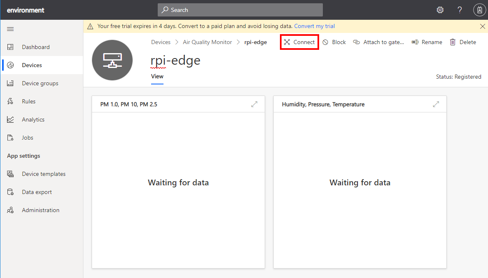
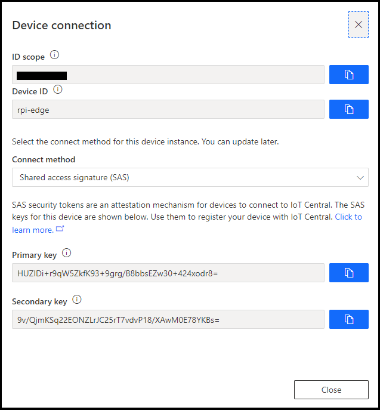
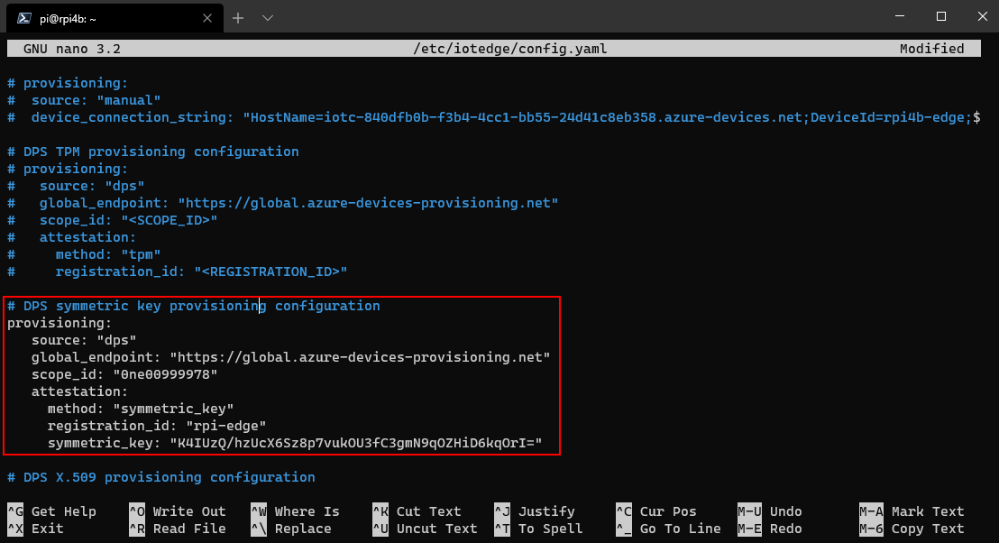

# Part 3: Air Quality Monitor with Azure IoT Edge and IoT Central

When I think about building Azure Iot Edge solutions I think in three steps: Crawl, Walk, Run. Summarized as follows:

1. Crawl: This is part 1 of the Air Quality Monitor solution. Get you code written, debugged, and running on the IoT device, in this case the Raspberry Pi.
2. Walk: This is part 2 of the Air Quality Monitor solution. Now you have a working solution, Dockerise the it, ensuring all the required libraries are in the container, debugging into a container is working, and the application can control the hardware.

    For access to GPIO, I2C, SPI, and UART, you will almost certainly need to grant privileged access to the Docker container. Granting privileged access to the container allows the application to reach out from within the container to control hardware. 
    
    Granting privilege mode to a container also comes with inherent security risks, so just run what you need in the privileged container.
3. Run: Now you have your solution dockerised, we will migrate the solution to Azure IoT Edge

The tutorial assumes you have completed the crawl, walk stages and you are ready to run and create an IoT Edge solution. You will set up your Raspberry Pi, configured SSH authentication, enabled Visual Studio Code Remote SSH development, have the solution running in Docker on the Raspberry Pi, streaming telemetry to Azure IoT Central.

---

## Install Azure IoT Edge on the Raspberry Pi

Start an SSH session from your computer to the RAspberry Pi.

1. Start a new terminal window on your computer. On Windows, open a new PowerShell window, on macOS and Linux, open a new Bash shell.
2. Start a new SSH session to your Raspberry Pi
    ```bash
    ssh pi@<Raspberry Pi IP Address>
    ```
3. Authenticate. The default Raspberry Pi password is **raspberry**.

### Install IoT Edge

From the SSH session, run the following commands:

1. Install the *libssl1.0.2* library required by Azure IoT Edge.

    ```bash
    sudo apt-get install libssl1.0.2
    ```

2. Copy the following bash command block, and paste into the SSH session to install Azure IoT Edge. Press <kbd>Enter</kbd> to start the installation process.

    ```bash
    curl https://packages.microsoft.com/config/debian/stretch/multiarch/prod.list > ./microsoft-prod.list && \
    sudo cp ./microsoft-prod.list /etc/apt/sources.list.d/ && \
    curl https://packages.microsoft.com/keys/microsoft.asc | gpg --dearmor > microsoft.gpg && \
    sudo cp ./microsoft.gpg /etc/apt/trusted.gpg.d/ && \
    sudo apt-get update && \
    sudo apt-get -y install iotedge
    ```

**Do NOT close the SSH session.**

---

## Configure Azure IoT Edge on the Raspberry Pi

From IoT Central, open the device you created in Part 1 of creating an Air Quality Monitoring solution. This section assumes you named the IoT Edge device **rpi-edge**.

1. From the devices tab, select the **rpi-edge** device.
2. Click on **Connect** to reveal the device connection information.

    

3. Ensure **Shared access signature (SAS)** is selected.
4. Make a note of the **ID Scope**, the **Device ID**, and the **Primary key**.

    

5. Switch back to the SSH session you opened
6. Edit the IoT Edge configuration file. Start the nano text editor as follows.
    ```bash
    sudo nano /etc/iotedge/config.yaml
    ```
7. Using the cursor keys, move down to the line that reads **# DPS symmetric key provisioning configuration**.

    

8. Uncomment the DPS symmetric key provisioning configuration section, and update the scope id, registration_d, and the symmetric_key properties using the information from the IoT Central Device connection information page.
9. Save the /etc/iotedge/config.yaml file by pressing <kbd>ctrl+x</kbd>, and press **y** to confirm the save.
10. Restart Azure IoT Edge on the Raspberry Pi with the following command.
    ```bash
    sudo systemctl restart iotedge
    ```

**Do NOT close the SSH session.**

---

## Install the Docker Registry on the Raspberry Pi

Azure IoT Edge relies on Docker images being distributed from a [Docker Registry](https://docs.docker.com/registry/). In production you would deploy Docker images from a registry such as [Azure Container Registry](https://azure.microsoft.com/en-us/services/container-registry/) or [Docker Hub](https://hub.docker.com/).

When you are developing an Azure Iot Edge module it is more productive to have a local container registry as it avoids pushing the Docker image to a cloud registry each time you make a code change.

From the SSH session you previous started.

```bash
docker run -d -p 5000:5000 --restart=always --name registry registry:2
```
---

## Clone the IoT Edge solution to the Raspberry Pi

From the SSH session you previous started.

```bash
git clone ...
```

---

## Start a VS Code Remote SSH Session


## Install VS Code Extensions on the Raspberry Pi

1. Azure Iot Tools
2. Azure Account
2. Docker


## Clone Azure IoT Edge Air Quality Monitor solutuion

```bash
git clone
```


## Open the Azure IoT Edge solution with Visual Studio Code

1. Start Visual Studio Code
2. Start the SSH Remote Development solution

## References

[Tutorial: Create and connect a client application to your Azure IoT Central application (Python)](https://docs.microsoft.com/en-us/azure/iot-central/core/tutorial-connect-device-python)

## Explore the Solution

This project was created using the Azure IoT Edge extension. To learn more, see [Tutorial: Develop and deploy a Python IoT Edge module for Linux devices](https://docs.microsoft.com/en-in/azure/iot-edge/tutorial-python-module).


https://stackoverflow.com/questions/50337042/how-to-generate-a-proof-of-possesion-for-a-x509-certificate-using-openssl


https://github.com/Azure/azure-iot-sdk-c/blob/master/tools/CACertificates/CACertificateOverview.md

https://docs.microsoft.com/en-us/azure/iot-edge/how-to-auto-provision-x509-certs


https://docs.microsoft.com/en-us/azure/iot-edge/how-to-create-test-certificates


https://docs.microsoft.com/en-us/azure/iot-edge/how-to-auto-provision-x509-certs


I got the answer with the Azure support team.

1. Generate root key and X509 cert

    ```bash
    openssl req -x509 -newkey rsa:2048 -keyout root_private.pem -nodes -out root_cert.pem
    ```
2. Generate the verification cert...

    **Create verification key**

    ```bash
    openssl genrsa -out verification.key 2048
    ```
    **Create the verification cert**

    When creating the verification cert, I need to specify the verification code obtained (7A69A4702DA903A41C3A5BC5575A8E3F49BEC5E5BA2D4CE1) as the "Common Name" certificate field.

    ```bash
    openssl req -new -key verification.key -out verification.csr
    ```
3. Create the proof of possession certificate with the following command:

    ```bash
    openssl x509 -req -in verification.csr -CA root_cert.pem -CAkey root_private.pem -CAcreateserial -out verificationCert.pem -days 1024 -sha256
    ```